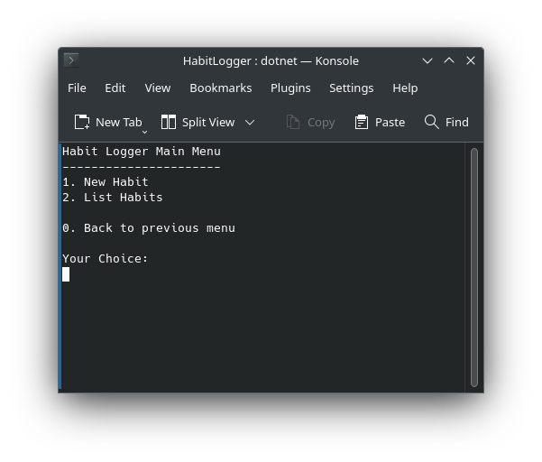
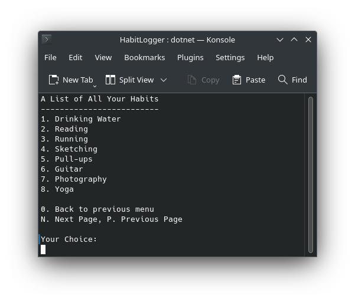
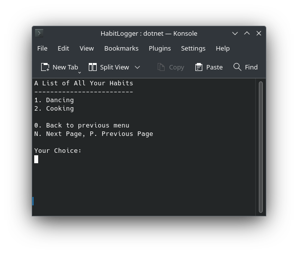
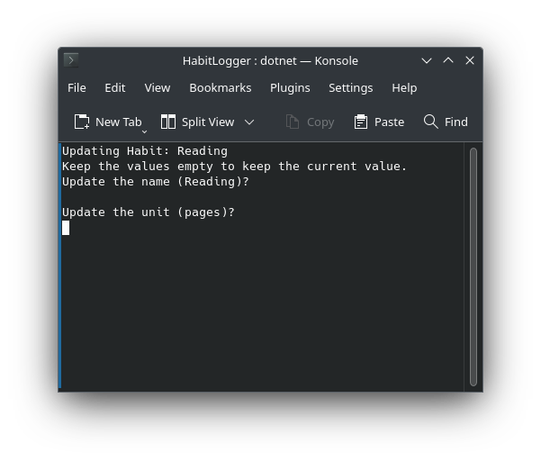
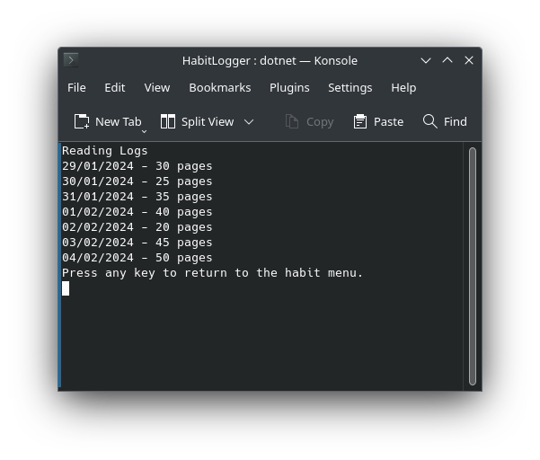

# Console Habit Logger
This is a simple app to log habits.

# Given Requirements:
 - [x] This is an application where you’ll register one habit.
 - [x] This habit can't be tracked by time (ex. hours of sleep), only by quantity (ex. number of water glasses a day)
 - [x] The application should store and retrieve data from a real database
 - [x] When the application starts, it should create a sqlite database, if one isn’t present.
 - [x] It should also create a table in the database, where the habit will be logged.
 - [x] The app should show the user a menu of options.
 - [x] The users should be able to insert, delete, update and view their logged habit.
 - [ ] You should handle all possible errors so that the application never crashes.
 - [x] The application should only be terminated when the user inserts 0.
 - [x] You can only interact with the database using raw SQL. You can’t use mappers such as Entity Framework.
 - [x] Your project needs to contain a Read Me file where you'll explain how your app works.

## Challenges
- [x] Let the users create their own habits to track. That will require that you let them choose the unit of measurement of each habit.
- [x] Seed Data into the database automatically when the database gets created for the first time, generating a few habits and inserting a hundred records with randomly generated values. This is specially helpful during development so you don't have to reinsert data every time you create the database.
- [ ]  Create a report functionality where the users can view specific information (i.e. how many times the user ran in a year? how many kms?) SQL allows you to ask very interesting things from your database.

# Features
The basic features are:
- Database persistence through SQLite
- Log multiple habits
- CRUD for both habits and logs

## Workflow
You start at the main menu, where you either choose to create a new habit or manage existing ones.

When you choose list it shows you an overview of all your habits to manage.

There is pagination so it works on smaller screens.

Once you choose a habit you can update it. It keeps the old value when you keep the prompt empty.

For every habit you choose you can see an overview of your logs for that habit.
